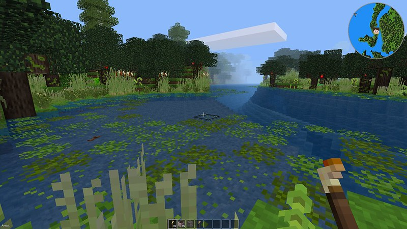

# Stonecraft

[](https://www.gnu.org/licenses/gpl-3.0)

An InfiniMiner/Minecraft inspired game powered by Luanti 5.11.0

Copyright (c) 2016-2025 Andreas "MrCerealGuy" Zahnleiter <mrcerealguy@gmx.de> and contributors




## Further documentation and links

- Website: http://mrcerealguy.github.io/stonecraft
- Itch.io: https://mrcerealguy.itch.io/stonecraft
- Wiki:    http://github.com/mrcerealguy/stonecraft/wiki
- Github:  https://github.com/mrcerealguy/stonecraft


## This game is not finished

- Don't expect it to work as well as a finished game will.
- Please report any bugs. When doing that, debug.txt is useful.

Please use the Stonecraft bug report.
https://goo.gl/forms/1MwRnBDntHntkuHg2


## Default Controls

All controls are re-bindable using settings.
Some can be changed in the key config dialog in the settings tab.

| Button                        | Action                                                         |
|-------------------------------|----------------------------------------------------------------|
| Move mouse                    | Look around                                                    |
| W, A, S, D                    | Move                                                           |
| Space                         | Jump/move up                                                   |
| Ctrl                          | Sneak/move down                                                |
| Q                             | Drop itemstack                                                 |
| Shift + Q                     | Drop single item                                               |
| Left mouse button             | Dig/punch/take item                                            |
| Right mouse button            | Place/use                                                      |
| Shift + right mouse button    | Build (without using)                                          |
| Tabulator                     | Inventory menu                                                 |
| Mouse wheel                   | Select item                                                    |
| 0-9                           | Select item                                                    |
| Z                             | Zoom (needs zoom privilege)                                    |
| T                             | Chat                                                           |
| /                             | Command                                                        |
| Esc                           | Pause menu/abort/exit (pauses only singleplayer game)          |
| R                             | Enable/disable full range view                                 |
| +                             | Increase view range                                            |
| -                             | Decrease view range                                            |
| K                             | Enable/disable fly mode (needs fly privilege)                  |
| P                             | Enable/disable pitch move mode                                 |
| J                             | Enable/disable fast mode (needs fast privilege)                |
| H                             | Enable/disable noclip mode (needs noclip privilege)            |
| E                             | Move fast in fast mode                                         |
| C                             | Cycle through camera modes                                     |
| V                             | Cycle through minimap modes                                    |
| Shift + V                     | Change minimap orientation                                     |
| F1                            | Hide/show HUD                                                  |
| F2                            | Hide/show chat                                                 |
| F3                            | Disable/enable fog                                             |
| F4                            | Disable/enable camera update (Mapblocks are not updated anymore when disabled, disabled in release builds)  |
| F5                            | Cycle through debug information screens                        |
| F6                            | Cycle through profiler info screens                            |
| F10                           | Show/hide console                                              |
| F12                           | Take screenshot                                                |

Most controls are settable in the configuration file, see the section below.


## World directory

- Worlds can be found as separate folders in:
```
<stonecraft-folder>/worlds/
```


## Configuration file

- Default location:
```
<stonecraft-folder>/stonecraft.conf
```

- It is created by Stonecraft when it is ran the first time.
- A specific file can be specified on the command line:
```
--config <path-to-file>
```


## Command-line options

```
Use --help
```


# Compiling

- [Compiling - common information](doc/compiling/README.md)
- [Compiling on GNU/Linux](doc/compiling/linux.md)
- [Compiling on Windows](doc/compiling/windows.md)


# Stonecraft WorldAtlas

A web-based viewer for Stonecraft/Luanti world maps generated with minetestmapper (Linux only).

[WorldAtlas on GitHub](https://github.com/MrCerealGuy/Stonecraft-WorldAtlas)


