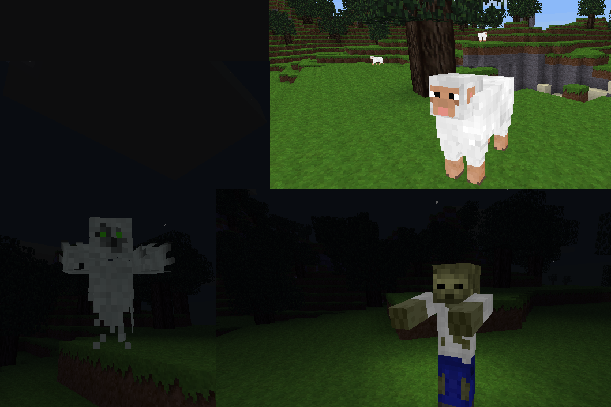

## Creatures Revived

Copyright (c) 2015-2016 BlockMen <blockmen2015@gmail.com>

Version: 1.1

---
### Description:

A revived version of BlockMen's Creatures MOB-Engine mod.

This mod provides an engine, that handles the base function for MOB in Minetest.
It offers an easy way to register MOB and allows to custom handling for the needs
of each mob. This engine aims to be a solid base, that has a good balance between
performance and functionality.
See API.txt for more informations on how to use this engine for mobs.

---
### Licensing:

- Code: [modified Zlib](LICENSE.txt) : (c) Copyright 2015-2016 BlockMen
- Sounds:
	- cmer_hit_01.ogg: CC0
- All other media (textures and sounds): (c) Copyright (2014-2016) BlockMen; CC-BY-SA 3.0

---
### Links:

- [Forum](https://forum.minetest.net/viewtopic.php?t=26684)
- [Git repo](https://github.com/AntumMT/mod-cmer)
- [API](https://antummt.github.io/mod-cmer/docs/api.html)
- [Changelog](changelog.txt)
- [TODO](TODO.txt)
- Original Creatures MOB-Engine by BlockMen:
	- [Forum](https://forum.minetest.net/viewtopic.php?t=8638)
	- [Git repo](https://github.com/BlockMen/cme)
- Other derivatives:
	- [Mob Engine](https://github.com/minetest-mods/mob-engine)
