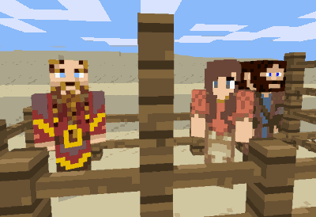

Minetest mod NPC MOBS
=====================

MOBS for simpler NPC and trader

Information
-----------

This added simple but working entities NPC or simpler non-player character, and also traders non-player characters.
Check the table names below for eggs or more.

Technical information
---------------------

### Downloads

This version is compatible backguard with 0.4 and also 5.X, can be downloaded from ContentDB or from tenplus1 notabug repos.

### Eggs for spawns

| name   | internal      | Notes |
|------- | ------------- | ----- |
| NPC    | mobs_npc:npc  | Acts like normal player, just a bot |
| Trader | mobs_npc:trader | Will just trade but does nothing more |
| Igor   | mobs_npc:igor | IT also will fight if you attack |

### NPC

- While NPC's don't actually spawn in the world just yet, they do have a spawn egg
available to drop him/her into the world and wander around defending himself if attacked.

- It will also he will help you attack any monsters in the area and will follow you
if you hold a diamond. Right-clicking the NPC with a gold lump will make him drop steel
tools or food, right-clicking with an empty hand orders the NPC to stay or follow if owned.

### Trader

- Traders are new and still being tested but can be placed into the world using a spawn egg.
Right-clicking on a trader opens his shop and allows you to buy his wares inside.

- If provoked a trader will attack a player or monster. Note: self.npc_drops and self.igor_drops
are used for random item list when trading for gold and may be changed within the mob itself,
if not found the global mobs.npc_drops and mobs.igor_drops are used instead for a default list.

### API's

mobs_npc.drop_trade(self, player, item_to_trade, item_drop_list)

mobs_npc.npc_talk(self, player, message_list)

- Note that message_list table overrides self.messages from mob definition.

mobs_npc.shop_trade(self, player, trader_list[names, items])

mobs_npc.add_trader_list(def)

'def' includes:
- block (block name in front of trader_block to use custom list e.g. "default:coalblock")
- nametag (name of trader e.g. "Larry")
- textures (trader texture list e.g. {"mobs_trader2.png"})
- item_list (items for trade e.g. { {"default:dirt 5", "default:gold_ingot 2"} })

## Trader Block

Craft a trader block using 7x stone, 1x diamond block centre, 1x tin block bottom middle)

Once placed, punch the trader block to spawn a Trader, only one can be spawned at a time, and by placing specific blocks below where the trader appears, custom traders can be created with their own textures, names and special item lists for sale.

License
-------

Check [license.txt](license.txt) file
