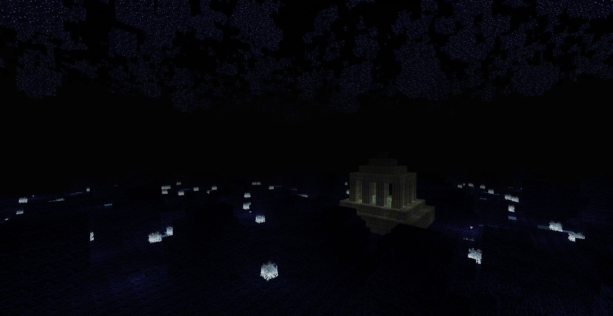

# minetest mod nssb

BIOME integration for nssm, the not so simple buildings

## information

A MAPGEN mod for Not so simple mobs (NSSM mod) that add spanners and new BIOME underground

It **add [buildings](#buildings) with monsters spanners around the world**, also
as feature **the [Morlendor](#mordenlor) dimension which can be reached by portals that spawns**
like the other buildings.

***From the portal, you have to follow the same direction of travelling from the Shire to Mordor!
Good luck!***

#### Morlendor

This is a new BIOME apart of the NSSM ones, it has a central temple where you appears,
the mobs there will be so hostile and the nodes will be pretty rare and hard to pick.

There are many minerals (around ten new ones) and many new enemies (around six new ones).

#### Buildings

This mod provides new forms of structures for living NSSM mobs, by example will provide
a new BIOME for each mob boos like kind event just the simpel BIOME from NSSM.

There are many new structures (around 20 new) inclusive inside the already provides by the NSSM.

## Technical information

This is a continuation of NPX Team's mod and currently provides bugfixeds and user contributions.

No new features are developed yet! Any new contribution please mantains most backguard compatibility.

### dependences:

* nssm
* tnt
* mobs

### configurations

This mod adds a dimension in the depths of the map, the [Morlendor](#mordenlor), **configurable**
using the `nssb.morlendor_level` parameter as negative integer:

* If `nssb.morlendor_level` is outside of `mapgen_limit`, the mod will try to autoset best setting.
* If `nssb.morlendor_level` it overlap `nether_depth_ymax`, of nether mod, an error will raise.

The morlendor level must be at least 320 layers of blocks over the limit, and 1000 layers of blocks below the nether deep floor.

### Nodes definitions

| Name Game            |  Name internal            | notes              |
| -------------------- | ------------------------- | ------------------ |
| Memoryone            | nssb:memoryone            | ·Non naturally generated ·Unbreakable        |
| Mossy Stone Brick    | nssb:mossy_stone_brick    | ·Same as Stone Brick except texture     |
| Stone Brick          | nssb:stone_brick          | ·Default Stone Brick |
| Very Mossy Stone Brick | nssb:very_mossy_stone_brick | ·Same as Mossy Stone Brick except texture  |
| Mossy Stone Column   | nssb:mossy_stone_column   | ·Same as Stone Brick except texture ·Screwdivable |
| Stone Column         | nssb:stone_column         | ·Same as Mossy Stone Column except texture |
| Seastone             | nssb:marine_stone         | ·Generated in oceans · Hard beetwen stone and bricks |
| Seastone Brick       | nssb:marine_brick         | ·Same as Seastone except texture |
| Sea Meselamp         | nssb:marine_meselamp      | ·Hard as Obsidian Glass ·Emits light level 15 |
| Morlamp              | nssb:morlamp              | ·Same as Sea Meselamp except texture |
| Mantis Clay          | nssb:mantis_clay          | ·Same as Default Stone except texture |
| Hardened Mantis Clay | nssb:hardened_mantis_clay | ·Hard as diamond ore ·Same except texture |
| Ant Stone            | nssb:ant_stone            | ·Same as Hardened Mantis Clay except texture |
| Vine                 | nssb:vine                 | ·Climbable ·Flamable · slab,Can be placed only on solid walls |
| Liana                | nssb:Liana                | ·Same as Default Ladder except texture |

### New buildings

This mod automatically puts in map some special structures based on enemies and biomes:

| build name mapgen   | build description biome    | frecuency    | biome |
| ------------------- | -------------------------- | ------------ | ----- |
| portal              | Portal center temple       | only one     | mordenlor |
| spiaggiagranchius   |                            | often        | sand  |
| acquagranchius      | struture for some marine   | often        |       |
| ooteca              |                            | often        |       |
| minuscolaooteca     |                            | often        | grass |
| piccolaooteca       |                            | often        | grass |
| arcate              |                            | often        | sand  |
| grandepiramide      |                            | often        | dirt  |
| collina             |                            | often        | grass |
| megaformicaio       |                            | often        | grass |
| antqueenhill        | antqueen trone inside ants | often        | grass |
| rovine1             |                            | often        | grass |
| rovine2             |                            | common       | stone |
| rovine3             |                            | common       | grass |
| rovine4             |                            | common       | grass |
| rovine5             |                            | common       | grass |
| rovine6             |                            | common       | grass |
| rovine7             |                            | common       | grass |
| rovine8             |                            | common       | grass |
| rovine9             |                            | common       | grass |
| rovine10            |                            | common       | grass |
| bozzoli             |                            | common       | grass |
| picco               |                            | often        | sand  |
| piccoghiaccio       |                            | often        | snow  |
| icehall             |                            | often        | ice   |
| piccomoonheron      |                            | often        | snow  |
| doppiopiccoghiaccio |                            | often        | snow  |
| doppiopiccosabbia   |                            | often        | sand  |
| piccoscrausics      |                            | often        | sand  |
| fossasand           |                            | often        | sand  |
| blocohouse          |                            | common       | stone |
| bigblocohouse       |                            | common       | stone |
| blocobiggesthouse   |                            | common       | stone |

### Spawn definitions

This mod automatically will spawms some specific enemies over the map:

| monster      | nodes under    | nodes around    | moment where  | level where spawn    |
| ------------ | -------------- | --------------- | ------------- | -------------------- |
| nssm:morvy   | nssb:morentir  | nssb:morentir   | day and night | mordenlor/underground|
| nssm:morbat1 | air            | nssb:morelentir | day and night | mordenlor |
| nssm:morbat2 | air            | nssb:morelentir | day and night | mordenlor/underground|
| nssm:morbat3 | air            | nssb:morelentir | day and night | mordenlor |
| nssm:morlu   | nssb:morentir  | nssb:mornen     | day and night | mordenlor |
| nssm:morde   | nssb:morentir  | nssb:mornar     | day and night | mordenlor |
| nssm:mordain | nssb:morentir  | nssb:morentir   | day and night | mordenlor/underground|
| nssm:morgut  | nssb:morentir  | nssb:morentir   | day and night | mordenlor/underground|

### Crafting definitions

WIP

# LICENSE

* License: LGPLv2.1 or later
    * Copyright 2016-2018 NPX Team and Contributors
    * Copyright 2017-2019 taikedz
    * Copyright 2021-2022 tenplus1
    * Copyright 2021-2022 PICCORO Lenz McKAY @mckaygerhard
* License for media: CC-BY-SA 4.0
    * Copyright 2016-2018 NPX Team and Contributors

Check [LICENSE.txt](LICENSE.txt)
