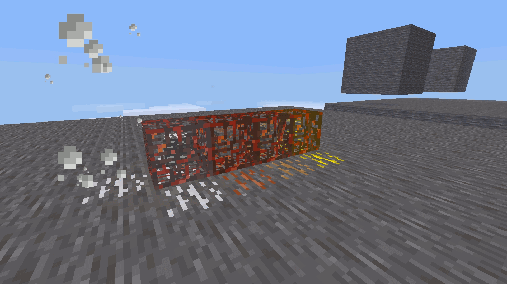
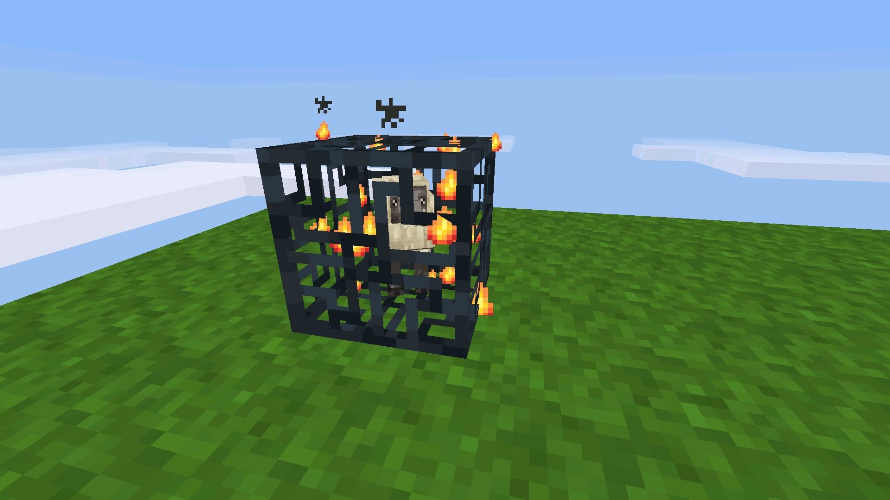
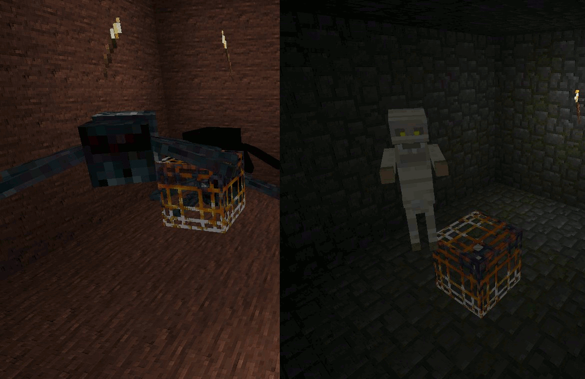

# Spawners Modpack #
This MOD for Minetest adds multiple spawner blocks. There ara no ABM's used and this modpack is developed with focus on the best multiplayer online server performace.

Easy to implement new mob mods just look in to config.lua.
New features can be enabled/disabled in settings.txt file.

Currently it works with [Mobs Redo](https://forum.minetest.net/viewtopic.php?f=11&t=9917) and [Creatures](https://forum.minetest.net/viewtopic.php?f=11&t=8638) but other mob mods can be easily added to config.lua

## Spawners Ores ##

This MOD for Minetest let the player craft ore Spawners. Ores are spawning randomly in a short intervals and you get 10% more ores from inputed ingots. Ores are spawning only in default:stone so make sure there is one around. This MOD is giving the option of creating lumps back from ingots.

### Mod dependencies ###
* default

## Spawners Mobs ##

This MOD for Minetest let the player craft Mob Spawners. Mobs are spawning randomly in a short intervals. This MOD is giving the option of creating mob farms and grinders.

### Mod dependencies ###
* default
* fire?
* xpanes?
* mobs?
* creatures?
* bones?

fake_fire, xpanes for recipes

bones are for mob drops only

## Spawners Environmental ##

This MOD for Minetest adds environmental spawners to the map. When enabled, the spawners will be added to newly generated Dungeons (Uruk Hai) and Temples (Spider). They are dropping a real mob spawner by change (very small chance).

### Mod dependencies ###
* default

## Links ##
[[Mod]Minetest Forum Page](https://forum.minetest.net/viewtopic.php?f=11&t=13857)

[[Server]Minetest Forum Page](https://forum.minetest.net/viewtopic.php?f=10&t=13727) - try this MOD on this server

[G+ Collection](https://plus.google.com/collection/06fEx)

[G+ Community](https://plus.google.com/communities/105201070842404099845)

## License ##

## Changelog ##

### 1.0 ###
* refactored Spawners Ores - best multiplayer performance usable on online servers
* refactored Spawners Mobs - best multiplayer performance usable on online servers
* refactored Spawners Env - best multiplayer performance usable on online servers

### 0.6 ###
* inherited BlockMen Pyramid mod, so now Spawners can spawn Pyramids in desert (mapgen v6)
* spawning Pyramids work independently from BlockMen Pyramids mod (can be removed) but works also besides BlockMen Pyramid mod 
* added more various loot (default) in pyramids chests and higher up the chance of spawning more loot
* added new environmental spawners
* added generation of environmental spawners for default mapgen v6 temples and dungeons
* addend new config parameter 'disable' for night_only attribute in config file
* added new attribute 'env' in config file for defining environmental spawners
* added settings.txt file for enable/disable new features (pyramids, mapgen spawners..)
* fixed abm catch_up (disabled), now it works

### 0.5.1 ###
* added mobs redo stone monster spawner (re-done from BlockMen Pyramids)

### 0.5 ###
* new mobs redo sheep textures
* added mobs redo spider spawner
* added oerrki spawner for creatures mod
* added screenshot and description for MODs in-game tab
* added pyramids mod to optional dependencies

### 0.4 ###
* NEW added ore spawners - iron, gold and copper
* ore spawners have chance to spawn 2 ores from 1 ingot
* ore spawners have formspec
* new sounds for ore spawners
* added particle effect for ore spawners
* re-done all textures from scratch (mob and ore spawners)
* adjusted mob spawners ABM
* added maximum stacked items for spawners to max 1
* mob spawners fixed name conflicts in config file warthog vs. pumba

### 0.3 ###
* new folder and file structure
* more convenient disable/enable, add/remove new MODs in config.lua file - added property for custom sounds
* added sound for bunny
* fixed sound for pyramids:mummy
* added footsteps and dug sounds for the spawners
* shorter and more effective code, easier to read, fixed variable namings
* ABM tweak - longer delay to trigger but bigger chance for spawn entity
* disabled ABM catch_up
* added normal map texture for default spawner

### 0.2 ###
* support pyramids mod - mummy
* support creatures mod
* shorten the code - more effecient

### 0.1 ###
* Initial Release
* detects only 6 nodes for 'air' around the spawner [top, bottom, left, right, front, back] afterwards it will check the node above and below the found 'air' node - so there is enough space to spawn someone
* always picks random side from where the mob will spawn
* detects for light and time of day - spawn mobs only at night if 'only_night' set to true
* status 'waiting' - blue sparkles, for not enough light (day spawners) or too much light for night spawners
* status 'default/inactive' i.e. if the spawner is closed from each side or there is no space to spawn mob
* status 'active' when spawner is active and is spawning mobs
* status 'overheat' when there is too much 'max_objects_per_block' (prevents from server errors), max value is taken from minetest.conf
* easy to configure, add and remove MODs for mobs
* only [Mobs Redo](https://github.com/tenplus1/mobs) from tenplus1 is added for now
* added recipes for all spawners, it's expensive so it will not get overcrowded on the server only with spawners 
* almost everything is done dynamically
* spawners emit small amount of light
* active and overheated spawner can cause fire to flammable nodes around it
* spawners are active only if player is in radius (21)
* spawners are diggable only with steel pickaxe and above, so no noob griefers can raid your base too easy
* mobs play sound when spawned
* animated textures