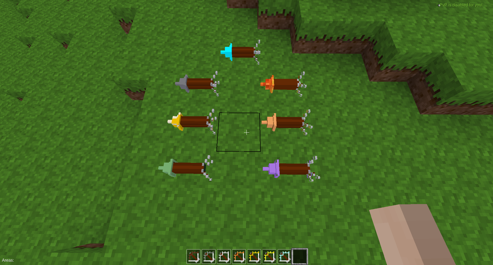

# Bows and Arrows for Throwing

This mod registers basic bows and arrows for the [throwing API](https://github.com/MT-Eurythmia/throwing). It makes `throwing` a compatible replacement for the throwing mod by PilzAdam.

## Settings

The settings are the following:
```
throwing.enable_arrow = true
throwing.enable_golden_arrow = true
throwing.enable_diamond_arrow = true
throwing.enable_fire_arrow = true
throwing.enable_teleport_arrow = true
throwing.enable_dig_arrow = true
throwing.enable_dig_arrow_admin = true
throwing.enable_build_arrow = true

throwing.arrow_teleport_in_protected = true
```

## Screenshot


